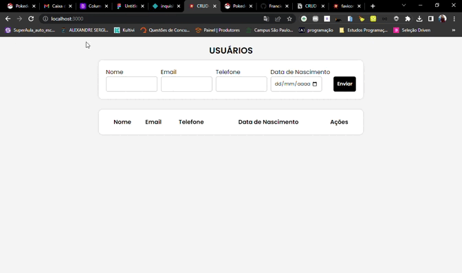

# **Projeto Crud ReactJS & NodeJS**

Este é um projeto de exemplo para um aplicativo de gerenciamento de registros (CRUD) usando ReactJS no front-end e Node.js no back-end.

## **Pré-requisitos**

- Node.js instalado na máquina
- npm ou yarn instalado na máquina
- Conhecimento básico em ReactJS e Node.js

## **Instalação**

1. Clone este repositório na sua máquina: **`git clone https://github.com/Francielefernandes06/CRUD_NodeJS.git`**
2. Acesse a pasta do projeto: **`cd CRUD_NodeJS`**
3. Instale as dependências do back-end: **`cd api`** e depois **`npm install`** ou **`yarn install`**
4. Instale as dependências do front-end: **`cd frontend`** e depois **`npm install`** ou **`yarn install`**

## **Execução**

1. Inicie o servidor Node.js: **`cd api`** e depois **`npm run start`** ou **`yarn server`**
2. Inicie o aplicativo React: **`cd frontend`** e depois **`npm start`** ou **`yarn start`**
3. O aplicativo estará disponível em **`http://localhost:3000`**

## **Funcionalidades**

- Adicionar um novo registro
- Listar todos os registros
- Atualizar um registro existente
- Deletar um registro existente

## **Tecnologias utilizadas**

- React
- Node.js
- Express
- MySQL (opcional)

## **Contribuição**

Este é um projeto de exemplo para fins de aprendizagem, mas qualquer contribuição é bem-vinda! Sinta-se à vontade para criar pull requests ou relatar bugs.

## **Tela**

## Autor

<a href="https://github.com/Francielefernandes06">
 
  
 <b>Franciele Fernandes</b></a> <a href="https://github.com/Francielefernandes06" title="GitHub">☕</a>

Feito com ❤️ por Franciele Fernandes 👋🏽 Entre em contato!

  
 

 

